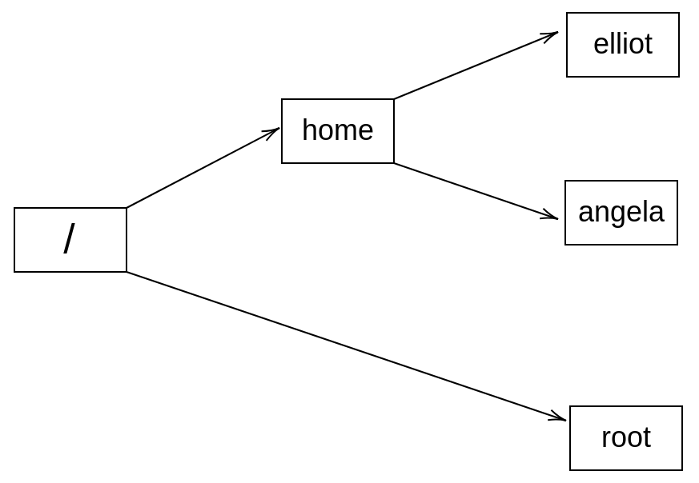

Who Is Root?

So far, user [elliot] has been able to do quite a few things on
the system. However, there are a whole lot of things that user
[elliot] can\'t do! To demonstrate, let\'s try to create a file
named [happy] in the [/var] directory:

``` 
elliot@ubuntu-linux:~$ touch /var/happy
touch: cannot touch '/var/happy': Permission denied
```

Oops! We got a [Permission denied] error.

Now let\'s try to create a new directory named [games] in
[/etc]:

``` 
elliot@ubuntu-linux:/$ mkdir /etc/games
mkdir: cannot create directory '/etc/games': Permission denied
```

Again! We are getting the same error, [Permission denied]!

So what\'s going on here? Well, the user [elliot] doesn\'t have
permission to do whatever he wants on the system! So who then? Who has
permission to do anything on the system? It\'s the root user.


**WHO IS ROOT?**

[root] is a Linux user that has permission to do anything on the
system. [root] is also known as the superuser.


Accessing the root user
=======================


You can run the [sudo -i] command to access the [root] user
for the first time on your system:

``` 
elliot@ubuntu-linux:~$ sudo -i
[sudo] password for elliot:
root@ubuntu-linux:~#
```

You will be prompted to enter your password, and then, all of a sudden,
you have got superpowers!

Notice how the command prompt changed instead of a dollar sign
([\$]), it now shows a [\#] to greet the root user.

Let\'s run the [whoami] command to make sure that we are now
logged in as the root user:

``` 
root@ubuntu-linux:~# whoami 
root
```

Awesome! Now let\'s display the current working directory:

``` 
root@ubuntu-linux:~# pwd
/root
```

Remember earlier that I told you that the home directory for the
[root] user is [/root] and not under [/home].





Now let\'s rerun both commands that we got permission denied for, but
this time, we run both commands as the [root] user.

``` 
root@ubuntu-linux:~# touch /var/happy 
root@ubuntu-linux:~# ls -l /var/happy
-rw-r--r-- 1 root root 0 Apr 15 10:53 /var/happy
```

As you can see, nothing can stop the [root] user from doing
anything! Now let\'s create the directory [games] in [/etc]:

``` 
root@ubuntu-linux:~# mkdir /etc/games 
root@ubuntu-linux:~# ls -ld /etc/games
drwxr-xr-x 2 root root 4096 Apr 15 10:55 /etc/games
```

We got no error, and that\'s because you have the power to do whatever
you want as the [root] user. But ALWAYS remember, with great power
comes great responsibility.


Setting the root password
=========================


You can also use the [su] command to switch to the [root]
user but first, you need to set the [root]\'s password:

``` 
root@ubuntu-linux:~# passwd 
Enter new UNIX password:
Retype new UNIX password:
passwd: password updated successfully
```

Amazing, now exit the [root] user:

``` 
root@ubuntu-linux:~# exit 
logout
elliot@ubuntu-linux:~$ whoami 
elliot
```

Now you can use the [su root] command to switch to the
[root] user:

``` 
elliot@ubuntu-linux:~$ su root 
Password:
root@ubuntu-linux:/home/elliot# whoami 
root
```


The dash difference
===================


Notice that my current working directory is now [/home/elliot] and
not [/root]. If I want to change that, I can exit back to user
[elliot] and rerun the [su] command but this time, I will
add a dash (hyphen) before [root] as follows:

``` 
root@ubuntu-linux:/home/elliot# exit 
exit
elliot@ubuntu-linux:~$ su - root 
Password:
root@ubuntu-linux:~# pwd
/root
```

So what is the difference?

Here\'s the deal. When you don\'t add the dash before the username, the
shell preserves the current user shell environment settings, which
includes the current working directory. On the other hand, when you add
the dash, the shell acquires the environment settings of the new user
(the user you switched to).

So let\'s do some practice. If you want to switch to user [elliot]
but preserve [root]\'s shell environment settings, then you don\'t
need the dash:

``` 
root@ubuntu-linux:~# pwd
/root
root@ubuntu-linux:~# su elliot 
elliot@ubuntu-linux:/root$ pwd
/root
elliot@ubuntu-linux:/root$
```

Notice how the current working directory didn\'t change when I switched
to user [elliot]. Now, let\'s exit and switch back again to user
[elliot], but this time, we will put a dash before the username:

``` 
elliot@ubuntu-linux:/root$ exit 
exit
root@ubuntu-linux:~# pwd
/root
root@ubuntu-linux:~# su - elliot 
elliot@ubuntu-linux:~$ pwd
/home/elliot
```

Now notice how the current working directory changed from [/root]
to [/home/elliot]. So here, the shell acquired the environment
settings of user [elliot].


**A COOL TIP**

If you run [su] with no username, then [su] will switch to
the root user. So if you want to save yourself some typing, you can omit
the username every time you want to switch to the root user.


Let\'s try out our cool tip! As user [elliot], run the [su]
command without specifying a username:

``` 
elliot@ubuntu-linux:~$ su 
Password:
root@ubuntu-linux:/home/elliot#
```

You can then enter the [root] password to log in as [root].

You can also use the dash to acquire [root]\'s shell environment
settings:

``` 
elliot@ubuntu-linux:~$ su - 
Password:
root@ubuntu-linux:~# pwd
/root
```

This time I landed in [/root] because I used the dash.

Well, this was a short chapter, but the [root] user certainly
deserves a whole section by itself. Also, remember that you have got
superpowers when you are the [root] user as you have the
permission to do anything on your system. And so if you are not very
careful, you can damage your system, and that\'s why there is a very
famous Linux meme that says, \"Don\'t drink and root!.\"


Knowledge check
===============


For the following exercises, open up your Terminal and try to solve the
following tasks:

1.  Switch to the [root] user.
2.  Change the password for the [root] user.
3.  Switch to user [elliot] and land in [/home/elliot].
4.  Now switch to user root but preserve the current working directory
    [/home- /elliot].

True or false
-------------

1.  The [root] user is the most powerful user in Linux.
2.  Using the [su] command without specifying a username will
    switch you to the root user.
3.  We use the [passroot] command to change the password for the
    [root] user.
